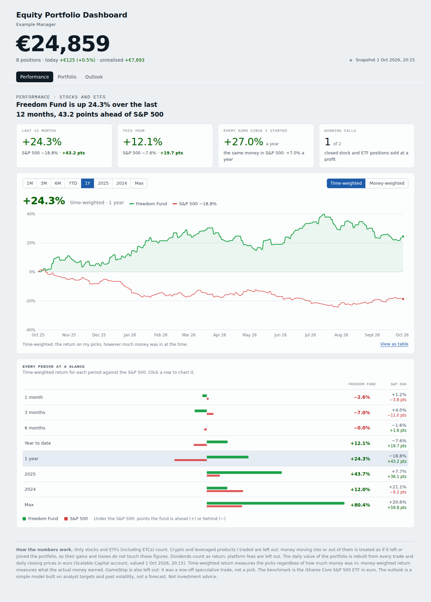

# Equity Portfolio Dashboard

A single-page dashboard of a concentrated stock-picking portfolio, called the Freedom Fund on the page, built from a Scalable Capital account. It is
written for peers: to show how the picks have done, what is owned and how each position is doing, and what could
happen next. Only stocks and ETFs count; crypto, leveraged products and the one-off GameStop trade are left out
(see *Method*).

The header shows the portfolio's value today in large type, with today's change and the unrealised gain. The page
answers three questions, one per tab:

| Tab | Question it answers | What is on it |
|---|---|---|
| **Performance** | Have the picks made money, and against which index? | Four headline figures; a daily chart of time-weighted (TWR) or money-weighted (MWR) performance for 1M, 3M, 6M, YTD, 1Y, 2025, 2024 or Max (since inception) against the S&P 500, the only benchmark; *Every period at a glance* compares every period with it |
| **Portfolio** | What is owned and how is each position doing? | Per position: weight, share-price change over 1D, YTD and 1Y, unrealised gain in euro and in per cent, the 12-month target range (bear, weighted outcome, bull) and the consensus rating with the upside to the average target. Each opens to the thesis, the written kill-switch, bull and bear cases, industry and competitors, and the latest news |
| **Outlook** | What could happen next? | A horizon toggle (3M, 6M, 1Y, 2Y, 3Y) and three sets of scenario odds (Consensus, Cautious, Stress) drive the expected return, the 9-in-10 range of outcomes, the chance of beating the S&P 500, volatility and beta, and a range-of-outcomes chart |



The screenshots in `docs/` come from the **synthetic sample** in `data/sample`. They are not real
account data.

## Privacy: what is in this repository and what is not

The repository is public, so it holds **code, method and public-company research only**. Everything that
describes a real account lives in `data/private/`, which `.gitignore` excludes:

| In the repository | Kept out (`data/private/`) |
|---|---|
| Pipeline, page code, tests | `tx.csv`: every deposit, withdrawal, trade, dividend and fee |
| Research notes on listed companies (`research/`) | `snapshot.json`: positions, quantities, prices, account value and gains |
| | `history.json`: the rebuilt month-by-month account value |
| A fully synthetic sample account (`data/sample/`) | `profile.json`: manager name, theses and kill-switches |
| Screenshots of the synthetic sample | `names.json`, `types.json`, `splits.json`, `series.json`, `prices_monthly.json`: the instrument history and the price data pulled for the account |
| | `dist/`: the built page, which embeds all of the above |

To build the real page you need a copy of `data/private/` on your machine. To try the project without it,
use the sample (see below).

## Quick start

Requirements: Node 18 or later. Playwright is needed only for the tests.

```bash
# Try it with the synthetic sample (no personal data needed)
npm run sample          # writes data/sample/*, then dist/sample.html

# Build the real page from data/private/
npm run prices          # refresh daily closing prices (Yahoo Finance), writes data/private/prices_daily.json
npm run build           # ledger -> history -> data -> page, writes dist/portfolio.html

# Tests: render every tab at desktop, dark and phone widths, then exercise live refresh
npm install             # installs Playwright
npm test                # real build
npm run test:sample     # sample build
```

`dist/portfolio.html` is written for the claude.ai Artifact host. It has no `<html>`, `<head>` or `<body>`
because the host wraps the page in its own skeleton. Open it directly in a browser and it still renders, with
the browser filling in the missing tags.

## Repository layout

```
├── src/
│   ├── core.js              Analytics shared by the page and Node: returns, XIRR, Modified Dietz,
│   │                        volatility, beta, drawdown, back-cast, risk contribution, formatters
│   └── page/
│       ├── style.css        The page's design tokens and styles (light and dark)
│       ├── model.js         State, the derived model (TWR/MWR by period, risk, scenarios)
│       │                    and the chart toolkit (line chart, fan chart, sparkline, tooltip)
│       ├── views.js         The three tabs, the masthead and the method notes
│       └── live.js          Live refresh from the Scalable Capital connector, the research
│                            subscription, and boot
├── pipeline/
│   ├── ledger.js            tx.csv -> ledger.json: FIFO cost basis by custody account, realised P&L,
│   │                        income, cash flows, and a reconciliation against the broker
│   ├── holdings_history.js  Replays tx.csv into holdings and cash at any date (shared helper)
│   ├── fetch_daily.js       Downloads daily closes in euro for every instrument held and every index
│   ├── fetch_index_history.js  Each index's annualised growth since January 1989 (historical CAGR)
│   ├── history.js           Rebuilds the account value for every trading day from the
│   │                        replay and market prices, and checks it against the broker's own figures
│   ├── add_prices.js        Appends month-end prices for one instrument to prices_monthly.json
│   ├── build_data.js        snapshot + ledger + history + prices + profile + research -> data.json
│   ├── build_page.js        data.json + src/ -> one self-contained HTML page
│   ├── make_sample.js       Writes the synthetic sample account in data/sample/
│   └── profile.template.json  Template for profile.json (manager name, positions)
├── research/
│   ├── stocks.js            Per company: industry, market, position, competitors, bull and bear case,
│   │                        and sell-side consensus (rating, analyst count, average/low/high target)
│   └── comments.js          Per company: business, thesis, risks, dated news and sources
├── routine/
│   └── daily-research.md    The scheduled routine that refreshes the news on the page every morning
├── tests/
│   ├── render.js            Renders every tab in Chromium; fails on console errors or sideways scroll
│   └── live.js              Mocks the connector and the research store; checks refresh, partial
│                            failure, refused permission, escaping and link safety
├── data/
│   ├── sample/              Synthetic inputs (committed)
│   └── private/             Real inputs (git-ignored)
└── docs/                    Screenshots of the sample build
```

## Data inputs

Every data directory, private or sample, holds the same files:

| File | Produced by | Contents |
|---|---|---|
| `tx.csv` | Export from the Scalable Capital transactions feed | `date,cust,kind,isin,qty,amt`. `cust` is the custody account (`B` Baader, `S` Scalable). `kind` is one of `buy sell div dep wdr xin xout bon fee int tout exp cbuy csell` |
| `names.json` | By hand or from the feed | ISIN to display name, for every instrument ever traded |
| `types.json` (optional) | By hand | ISIN to instrument type, overriding the default classification (crypto, `DE000BB` issuer prefix for leveraged products, `IE`/`LU` for ETFs, otherwise shares). Any type other than `Shares` or `ETFs & ETCs` (for example `"Excluded"`) leaves the instrument out of the figures |
| `snapshot.json` | Scalable connector: `get_portfolio_holdings`, `get_portfolio_overview`, `get_portfolio_cash_breakdown`, `get_security_quote`, `get_security_news` | Valuation time, total, cash, the broker's gain by period, each position (quantity, price, per-period performance, sector and theme) and the benchmark ETFs |
| `series.json` | `get_security_chart`, one year | Fallback when `prices_daily.json` is absent (the synthetic sample uses it) |
| `prices_daily.json`, `symbols.json` | `pipeline/fetch_daily.js` (Yahoo Finance chart data; `symbols.json` maps ISINs to tickers and can be edited) | Daily closing prices in euro for every instrument held and every index, from the first deposit |
| `index_history.json` | `pipeline/fetch_index_history.js` (part of `npm run prices`) | The S&P 500's annualised price growth since January 1989 (US dollars, excluding dividends), used as its expected return on the Outlook tab |
| `prices_monthly.json` | `get_security_chart`, max, stored with `pipeline/add_prices.js` | Month-end prices for every index and for each instrument held at a month end, from the first deposit |
| `splits.json` (optional) | By hand | Share splits, `{ISIN: [[YYYY-MM-DD, ratio]]}`. Chart prices are split-adjusted; ledger quantities before a split are not |
| `history.json` | `pipeline/history.js` | Derived: the account value on every trading day |
| `profile.json` | By hand, from `pipeline/profile.template.json` | Manager name and, per position, a one-sentence thesis and a kill-switch (the other fields in the template are optional and not shown) |
| `ledger.json`, `data.json` | The pipeline | Derived, never edited |

To refresh the snapshot, pull the connector responses again (a Claude session with the Scalable Capital
connector can do this) and overwrite `snapshot.json` and `series.json`. The page also refreshes positions,
prices, gains and news live when it is opened on claude.ai, as described next.

## How the live page works

When the page opens as a claude.ai artifact it asks for two runtime capabilities:

- **`mcp` (Scalable Capital, read-only tools).** On load and on *Refresh*, the page calls
  `get_portfolio_holdings`, `get_portfolio_overview`, `get_portfolio_cash_breakdown`, and for every holding
  and benchmark `get_security_quote` and `get_security_news`. Positions, prices, gains, today's value and the
  news summary are replaced; the daily price history stays as built. Anything that fails keeps its snapshot
  value and the status line says how many items did. No trading tool is ever called.
- **`db` (the artifact's own database).** The page subscribes to the `commentary` collection written by the
  [daily research routine](routine/daily-research.md) and shows it under *Latest* in each position.

The ledger-based figures (realised results, dividends, the bridge, the index comparison's cash flows) come
from `tx.csv` and change only when the page is rebuilt.

## Method

**What counts.** Shares and ETFs (including ETCs). Crypto, leveraged products and GameStop (a one-off speculative
trade, marked `Excluded` in `types.json`) are carved out: money moving into or out of them is treated as if it
left or joined the portfolio, so their gains and losses do not touch the figures. Dividends count; fees do not.

**Daily value.** `pipeline/history.js` replays every trade and prices the holdings at each day's close in euro,
then checks the rebuilt value against the broker's own figures.

**Time-weighted return.** Daily sub-period returns chained together (inflows at the start of the day, outflows
at the end), so the size and timing of deposits do not affect the result.

**Money-weighted return.** An internal rate of return (XIRR) on every flow into and out of the portfolio, with
the value at the end of the period as the final cash flow.

**Same money in the index.** This is a public market equivalent. Each cash flow is mirrored into the
benchmark ETF (iShares Core S&P 500, in euro) on the same day, at daily
closing prices. The result is what that money would be worth today, together with its own XIRR.

**Cost basis.** First in, first out within each custody account. A custody transfer moves lots and keeps
their original date and cost. This reproduces the broker's own unrealised gain per position to within a euro.

**Risk.** Volatility, beta, correlation, drawdowns and risk contribution apply **today's weights** to the
last 12 months of prices: a back-cast of the current book, not the history of past books. Returns are
daily, annualised with √252.

**Scenarios.** Per stock, bull is the highest sell-side 12-month target, base the average, and bear the lower
of the lowest target and a repeat of the stock's worst fall of the past year. Dollar targets are converted at
the euro rate implied on the day they were collected, so the upside is currency-neutral and is re-measured
against the live price. On the Portfolio tab the black tick in the 12-month target range is the weighted outcome: 25% bear, 50%
average target, 25% bull. The three presets weight bull, base and bear at 25/50/25 (*Consensus*), 15/45/40
(*Cautious*) and 5/35/60 (*Stress*).

**Range of outcomes.** A log-normal model: the median path is `V0 · exp((ln(1+μ) − σ²/2)·t)`, and the bands
are the 5th, 25th, 75th and 95th percentiles. μ is the expected 12-month return under the chosen preset, assumed
to repeat for horizons beyond a year, and σ the back-cast volatility. The S&P 500 is drawn at its own
historical annualised growth since January 1989 (from `index_history.json`) with its own volatility. The ETF
on the page only starts in 2009, so the long run uses the index itself, in US dollars. Like the analyst price targets behind the portfolio's expected return,
they exclude dividends. *Chance of beating* compares the two log-normal outcomes using the
back-cast correlation between the portfolio and the benchmark. Real markets have fatter tails than this model.

## Editing theses and kill-switches

Theses and kill-switches live in `data/private/profile.json` under `positions`, keyed by ISIN. A kill-switch
marked `"killDraft": true` shows a *draft* tag on the page until you confirm it and remove the flag. Run
`npm run build` after editing.

## Caveats

- Sell-side targets have a record of optimism, so treat the expected return as an upper reference rather than
  a forecast. The *Cautious* and *Stress* presets exist for that reason.
- The broker exposes no daily history of account value, so it is rebuilt from the trades and market prices.
  It matches the broker's own figures to within about 2%.
- Everything on the page is information about one account, not investment advice.
