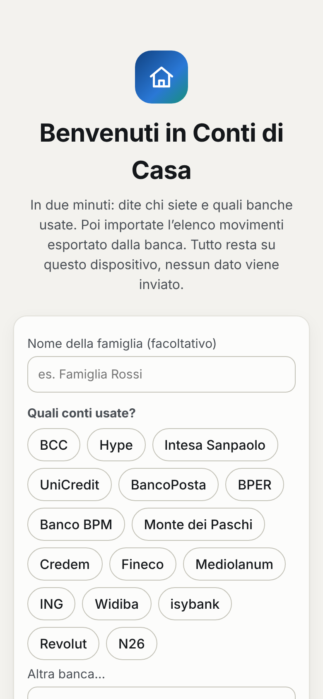
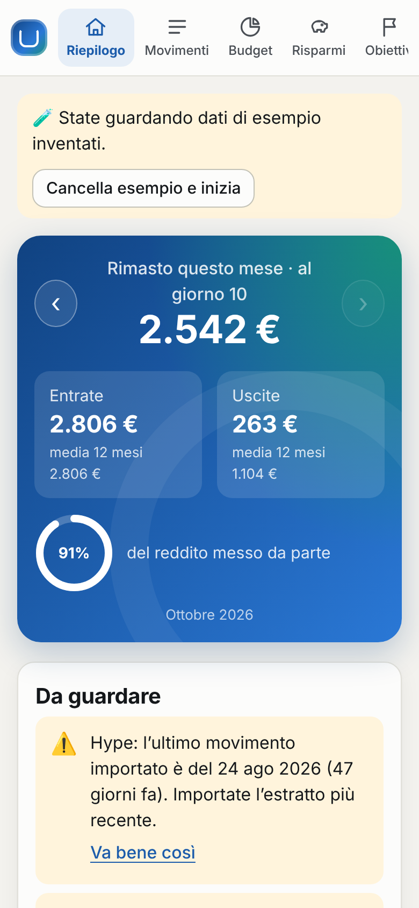
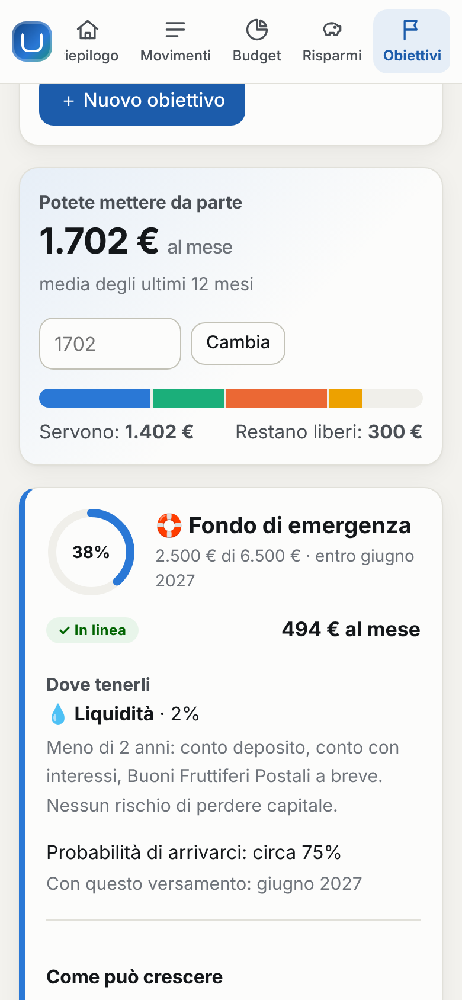

# Conti di Casa: household finance from your bank exports

A household finance tool for anyone with an Italian (or European) current account. It shows where the money goes,
runs checks on past transactions and finds ways to save. It also turns savings into a plan for medium-to-long-term
goals. It is **one HTML file** that opens in any browser and works offline. Data comes **only from the files the bank
lets you export** (Excel, CSV or the statement PDF). It stays in that browser and is never sent anywhere. Italian by
default, English one click away.


| Setup on a phone | Overview on a phone | Goals on a phone |
|---|---|---|
|  |  |  |

## What it does

| Section | What is on it |
|---|---|
| **Riepilogo** (Overview) | What is left this month, with income, spending (one-offs shown apart) and the share of income set aside; things worth a look; spending by category against the monthly average; progress on goals; savings found; balances; 12 months of income vs spending (with a table view) |
| **Movimenti** (Transactions) | Search and filters; one-click category changes that turn into rules; notes; mark as **one-off**; leave out of totals; add income or spending by hand, from an account or **cash** |
| **Budget** | A monthly limit per category, suggested from the last 6 months; one-offs do not count |
| **Risparmi** (Savings) | **Savings opportunities** found in the data, each with its yearly amount, an adjustable percentage and an "I'll do it" switch; **one-off expenses** over 12 months; **cash**: withdrawn vs noted, and how un-noted cash is usually split |
| **Obiettivi** (Goals) | How much can be set aside each month, goals funded by priority, where to keep the money for each horizon, the chance of getting there, how it could grow, and what to change if it is not enough |
| **Controlli** (Checks) | Checks on past data, suggestions, regular payments found automatically, import history with undo |
| **Importa** (Import) | Drop in the bank's file: a preview, column mapping where needed, duplicates skipped, export tips for the banks chosen at setup |
| **Impostazioni** (Settings) | Household name, accounts and real balances, the assumptions behind goals, rules, categories, backup and restore, language |

### Setting up for any household

The first screen asks for a household name and which banks are used: BCC, Hype, Intesa Sanpaolo, UniCredit,
BancoPosta, BPER, Banco BPM, MPS, Credem, Fineco, Mediolanum, ING, Widiba, isybank, Revolut, N26, or any other.
It also asks whether cash is used often. It creates the accounts and opens the Import page with export tips for
those banks. The importer does not depend on the bank. It finds the header row on its own, and reads Italian and
English column names (*Data contabile, Descrizione, Importo, Dare/Avere, Entrate/Uscite, Saldo*; *Completed Date,
Description, Amount, Balance*). It also reads Italian and English number and date formats. For any other layout,
the columns are mapped once in the preview and remembered.

### Adjustments: one-off expenses, cash, savings

- **One-off expenses** (a new washing machine, the dentist). They count in the month's spending but are left out
  of averages and budgets, so one big month does not distort the picture. The Savings section shows their yearly
  total and the monthly amount to allow for them. A check for unusual expenses offers to mark one with a single click.
- **Cash.** A withdrawal says nothing about where the money went. Cash spending noted by hand replaces the same
  amount of withdrawals, so nothing is counted twice. Whatever is not noted can be spread across categories by a
  split you choose (e.g. 60% groceries, 40% eating out). Each month shows how much was withdrawn, how much noted
  and how much is unexplained.
- **Savings opportunities.** Each one comes from the household's own transactions and has a yearly amount.
  Subscriptions to cancel. Phone plans well above €10-25 a month. Electricity and gas, with a pointer to ARERA's
  public [Portale Offerte](https://www.ilportaleofferte.it). Insurance quotes, bank charges, and trimming
  discretionary categories by a percentage you set. Cash, and idle money above a 6-month cushion. Marking one
  "I'll do it" adds it to what goes to the goals.

### Goals and a medium-to-long-term plan

- **How much can be set aside.** The average monthly surplus over the last 12 months, one-offs included, plus
  the savings decided. Or a figure you type in.
- **Goals** have a target, a date, what is already saved, a priority, and optionally a fixed monthly payment.
  The target can grow with inflation. An emergency fund of six months' spending is suggested first.
- **The plan** funds goals by priority, then date. Each goal gets the monthly payment that reaches its target with
  about a 3-in-4 chance, until the money runs out. The allocation bar shows who gets what, and what is short or free.
- **Where to keep the money** follows the horizon, as education rather than advice. *Cash* (under 2 years: deposit
  accounts, postal savings bonds). *Cautious* (2-5 years: government bonds maturing near the date, short-term bond
  funds). *Balanced* (5-10 years: bonds and global shares with monthly payments). *Growth* (over 10 years: mostly
  diversified global shares).
- **For each goal:** the chance of getting there, when it would be reached at the planned payment, and a fan
  chart. The chart shows the expected path, the 9-in-10 range and the money paid in. When a goal is tight or
  short, it says what would fix it: pay X a month, move the date to Y, or aim for Z.
- **Assumptions**, editable in Settings: yearly returns net of costs and tax of 2%, 3%, 4.5% and 6%; volatility of
  0.5%, 4%, 9% and 15%; inflation of 2%. The chance treats the average yearly return over the horizon as normally
  distributed. That is a simplification: real markets have fatter tails. Everything is labelled as an estimate,
  not advice.

### Checks on the past

Reconciliation of each account's balance between known points: the opening and closing balance of every file that
has a balance column, plus any real balance you type in. Possible double charges. Regular payments and their
changes: price rises, a missing payment (an alert when a pension is late), new subscriptions. Unusual expenses.
Budget overruns and the month's pace. Accounts not updated for over 40 days, and months with no transactions.
No recent backup. Any check can be dismissed and brought back.

### Editable over time

Rules learn from each correction and can be edited. Categories can be renamed or added. Imports can be undone.
Overlapping imports are safe: the same transaction from a spreadsheet and from a PDF is matched on amount within
two days. Transfers between your own accounts are paired and left out of the totals. Saved data carries a schema
version, and `migrate()` upgrades older saves.

## Getting the data in

Only files exported by the bank, from online banking or the app:

- **Excel (XLSX) or CSV**: the best choice. Old binary `.xls` files need saving as `.xlsx` first. Many "Excel"
  downloads are really HTML tables, and those are read directly.
- **Statement PDF**: for banks that only give a PDF, such as Hype's app. The text layer is read line by line. It
  takes the sign from the *Entrate/Uscite* columns, or from an explicit `+`/`−`, and flags rows where it had to
  guess. This is a best-effort heuristic: check the preview. Reading PDFs fetches [pdf.js](https://mozilla.github.io/pdf.js/)
  from cdnjs the first time; the PDF itself is read locally.

Export tips are shown for the banks chosen at setup. Where a bank's exact menu path is not known, a generic
guide is shown instead.

## Build, run, test

```bash
npm run household          # writes dist/household.html: the single file to hand over or open
npm run test:household     # unit tests (parsing, rules, checks, cash, one-offs, goals and savings maths), build, then Chromium
```

Open `dist/household.html` by double-clicking it. Data lives in the browser's IndexedDB, falling back to
localStorage. The app asks for a **backup** once a month and after each import (*Impostazioni → Scarica copia*).
The same file moves the data to another device. Try it without real data with *Prima voglio provare con dati di
esempio*: a synthetic couple with a BCC account and a Hype card, cash notes, a one-off purchase and four goals.
`sample/` has a BCC-style CSV and a Revolut-style CSV for testing imports.

To reach many people, the same file can be served as a static page from any host (GitHub Pages, for example).
Each visitor's data still stays in their own browser.

## Layout

```
household/
├── src/
│   ├── core.js      Parsing (CSV, tables, PDF lines), categories and rules, import and de-duplication, transfers,
│   │                monthly totals with one-offs and cash, recurring payments, checks, suggestions, demo data
│   ├── plan.js      Savings opportunities, saving capacity, goals plan, compounding, chance of success, projections
│   ├── i18n.js      Every string, Italian and English, and the bank list with export tips
│   ├── files.js     Browser readers: text encodings, XLSX (via DecompressionStream), HTML tables, PDF (pdf.js)
│   ├── store.js     IndexedDB / localStorage / memory
│   ├── charts.js    SVG rings, the income/spending bars and the goal fan chart, with a shared tooltip
│   ├── app.js       Onboarding, the eight sections, dialogs and events
│   └── style.css    Design tokens (light and dark), layout with sidebar or phone strip
├── build.js         Assembles one offline HTML file (add --artifact for hosts that supply <html>/<body>)
├── sample/          Synthetic BCC-style and Revolut-style exports
├── tests/           core.test.js and plan.test.js (node:test), ui.js (Playwright)
└── docs/            Screenshots of the demo data
```

Adding a bank's export tip is one line in `BANKS` (`src/i18n.js`). Adding a recognised column name is one word
in `HEADERS` (`src/core.js`). Adding a merchant rule is one word in `DEFAULT_RULES`.

## Privacy

This repository is public, so it holds only code, synthetic samples and screenshots of synthetic data. Real
exports and backups belong in `household/private/` (git-ignored), or stay in the browser.

## Known limits

- The PDF reader is a best guess at statement layouts. Excel or CSV is always more reliable.
- Categorisation is keyword-based (about 350 Italian merchants, utilities, insurers and banks). Expect to correct
  a few categories in the first month; it learns from each one.
- Savings amounts and goal projections are estimates under the stated assumptions, not financial advice.
- Data lives in one browser on one device. Moving it means a backup file; there is no sync, by design.
