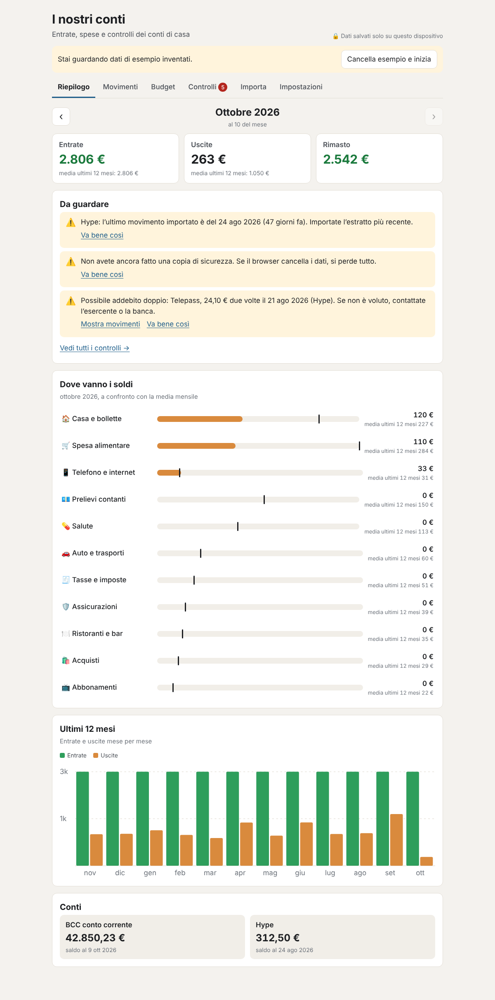
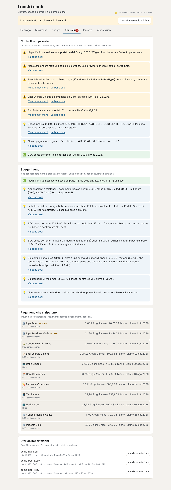
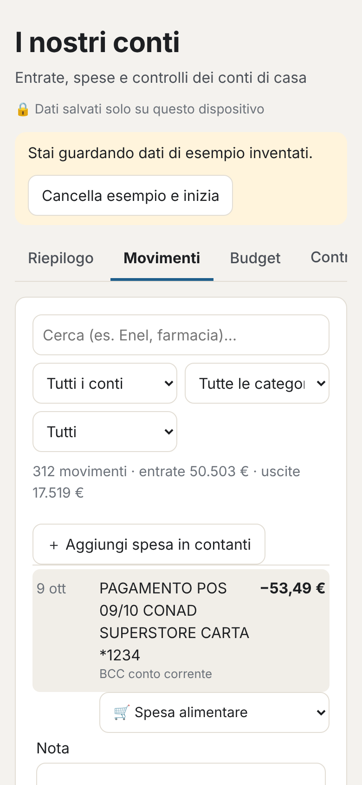

# I nostri conti: household finance for BCC and Hype

A simple tool for keeping an eye on the household accounts. It shows where the money goes, runs checks on past
transactions and makes suggestions. It is written for non-technical users (my parents): large type, plain Italian
(English is one click away), and nothing to install. It is **one HTML file** that opens in any browser and works
offline. The data stays in that browser and never goes to a server.



| Checks and suggestions | Transactions on a phone |
|---|---|
|  |  |

## What it does

| Tab | What is on it |
|---|---|
| **Riepilogo** (Overview) | This month's income, spending and what is left, against the 12-month average; the top 3 things worth a look; spending by category with the average marked; 12 months of income vs spending; account balances |
| **Movimenti** (Transactions) | Search and filter; change a category in one click (it then offers to do the same for every similar transaction); notes; leave out of totals; add a cash expense by hand |
| **Budget** | A monthly limit per category, with progress this month. It can suggest limits from the last 6 months |
| **Controlli** (Checks) | Checks on past data, suggestions, regular payments found automatically, and the import history with **undo** |
| **Importa** (Import) | Drop in a bank file: CSV, XLSX, HTML "Excel", the Hype statement PDF, or the bank-link JSON. There is a preview, column mapping where needed, and duplicates are skipped |
| **Impostazioni** (Settings) | Accounts and real balances, rules, categories, backup and restore, language |

### Checks on the past (backward checks)

- **Reconciliation.** When a file has a balance column, or a real balance is typed in, the opening and closing
  balances must match the sum of the transactions in between. Any difference means missing or doubled transactions.
- **Missing data.** It flags accounts not updated for over 40 days, and months with no transactions at all.
- **Possible double charges.** Same shop, same amount, same or next day.
- **Regular payments.** It finds monthly, two-monthly, quarterly, half-yearly and yearly payments and income on its
  own. It flags price rises (for example a phone bill going from €29.90 to €32.90), payments that did not arrive
  (an **alert if the pension is late**), and new subscriptions.
- **Unusual expenses** compared with that category's typical size.
- **Budget** overruns, and a projection for the month.
- **No recent backup.**
- Transactions read from a PDF whose sign (in or out) had to be guessed.

Each finding can be dismissed ("Va bene così"). Dismissed findings can be shown again.

### Suggestions

Savings rate; subscriptions and phone with their yearly total; utility bills that went up, pointing to ARERA's
public [Portale Offerte](https://www.ilportaleofferte.it); bank charges per account. Stamp duty: €34.20 a year
is due on a current account whose average balance is above €5,000. Cash sitting above a 6-month cushion;
categories growing fast; a high share of cash withdrawals. These are pointers, not financial advice.

### Editable over time

- **Rules learn.** Correct one category and it asks whether to apply it to that shop from now on. Rules are listed
  and can be deleted in Settings. Built-in rules cover about 300 Italian shops, utilities, insurers and banks
  (`DEFAULT_RULES` in `src/core.js`).
- **Categories** can be renamed or added.
- **Imports can be undone**, one file at a time, from the import history.
- **Overlapping imports are safe.** The same transaction is recognised by account, date, amount and description.
  One that arrives once from a file and once from the bank link is matched on amount within two days.
- **Transfers between your own accounts** (BCC → Hype top-ups) are paired automatically and left out of income and
  spending.
- The saved data carries a schema version, and `migrate()` in `src/core.js` upgrades older saves when the format changes.

## Getting the data in

Three routes, from least to most setup. All three can be mixed: duplicates are skipped.

### 1. Export from BCC online banking (CSV or Excel)

BCC banks use Relax Banking (Iccrea group) or Inbank (Cassa Centrale). On a computer, go to the account's
transaction list, pick the period, and export to Excel or CSV. The importer finds the header row by itself,
even below a few lines of account details. It recognises Italian column names (*Data contabile, Data valuta,
Descrizione/Causale, Importo* or *Dare/Avere, Entrate/Uscite, Saldo*), Italian numbers (`1.234,56`, `12,00-`)
and dates. If a bank uses unusual names, map the columns once in the preview. The mapping is remembered for
the next file with the same columns. Old binary `.xls` files need saving as `.xlsx` or `.csv` first.

### 2. The Hype statement PDF

The Hype app exports transactions only as a PDF statement. The app reads the PDF's text layer and recognises
dated lines with amounts. It uses the *Entrate/Uscite* column positions, or an explicit `+`/`−`, to decide the
sign. This is a heuristic written without a real Hype statement to hand. Check the preview, and use *Inverti
entrata/uscita* on any row flagged "segno da verificare". Reading PDFs loads [pdf.js](https://mozilla.github.io/pdf.js/)
from cdnjs the first time, so it needs a connection. The PDF itself is read locally.

### 3. Bank link (PSD2, automatic)

[Enable Banking](https://enablebanking.com) offers a free *restricted* production mode that reads **your own**
accounts through the PSD2 APIs every EU bank must provide. Both Hype and the BCC banks are reachable this way.
It is read-only: account information access cannot move money. GoCardless Bank Account Data, the usual
alternative, has not been taking new sign-ups since mid-2025.

One-off setup (someone comfortable with a terminal, e.g. me):

1. Sign up at enablebanking.com. In the Control Panel, add a **Production** application. Set the redirect URL
   to any https address you control, for example `https://example.com/callback`. It does not need to load.
   Keep the browser-generated key: a `.pem` file downloads.
2. In the Control Panel, use **Link accounts** to link the BCC and Hype accounts. Restricted mode only
   reads accounts linked this way.
3. Save the key as `household/private/<app id>.pem` and create `household/private/enablebanking.json`:
   ```json
   { "appId": "<application id>", "keyFile": "household/private/<application id>.pem", "redirectUrl": "https://example.com/callback" }
   ```
   `household/private/` is git-ignored.
4. Authorise each bank:
   ```bash
   npm run bank -- banks credito cooperativo     # find the exact bank name (also: banks hype)
   npm run bank -- link "<exact bank name>"      # opens the bank's login; paste back the address it redirects to
   ```
   Consent lasts up to 180 days, depending on the bank; Italian banks often allow 90. `npm run bank -- status`
   shows when it ends.
5. Each month:
   ```bash
   npm run bank -- fetch            # last 120 days; --days 400 for more history on the first run
   ```
   This writes `household/private/movimenti-YYYY-MM-DD.json` with transactions and the current balance of every
   account. Drop it into the Import tab. The balance becomes a reconciliation checkpoint automatically.

The script talks to the bank from your computer with your key. The browser app never holds bank credentials.

## Build, run, test

```bash
npm run household          # writes dist/household.html: copy that one file to my parents' computer
npm run test:household     # unit tests (parsing, rules, checks, bank mapping), build, then a Chromium run of the page
```

Open `dist/household.html` by double-clicking it. Data is stored in that browser's IndexedDB, falling back to
localStorage. Browsers can clear this, so the app nags for a **backup** (*Impostazioni → Scarica copia*) once
a month and after each import. Keep the backup somewhere safe: it holds bank data.

Try it without real data: on first open, choose **Prova con dati di esempio**. The demo is a synthetic couple of
pensioners with a BCC account and a Hype card. The `sample/` folder has a BCC-style CSV and a bank-link JSON for
testing imports.

## Layout

```
household/
├── src/
│   ├── core.js      Parsing (CSV, tables, PDF lines, bank-link JSON), categories and rules, import and
│   │                de-duplication, transfers, recurring payments, checks, suggestions, demo data. Pure; shared with Node.
│   ├── files.js     Browser readers: text encodings, XLSX (via DecompressionStream), HTML tables, PDF (pdf.js)
│   ├── store.js     IndexedDB / localStorage / memory
│   ├── i18n.js      Every string on the page, Italian and English
│   ├── app.js       The six tabs, dialogs and events
│   └── style.css    Large type, light and dark
├── sync/enablebanking.js   PSD2 bank link (Node 18+, no dependencies)
├── build.js         Assembles one offline HTML file (add --artifact for hosts that supply <html>/<body>)
├── sample/          Synthetic BCC CSV and bank-link JSON
├── tests/           core.test.js and sync.test.js (node:test), ui.js (Playwright)
└── docs/            Screenshots of the demo data
```

## Privacy

This repository is public, so it holds only code, synthetic samples and screenshots of synthetic data. Real
statements, keys, bank sessions and downloaded transactions belong in `household/private/` (git-ignored) or stay
in the browser.

## Known limits

- The Hype PDF reader is a best guess at the layout. Real statements may need the heuristics in
  `txnsFromPdfLines` adjusting. Hype through the bank link avoids the PDF entirely.
- Categorisation is keyword-based. Expect to correct a few categories in the first month; it learns from each one.
- Data lives in one browser on one device. To use it on two devices, move a backup across. There is no sync by
  design.
